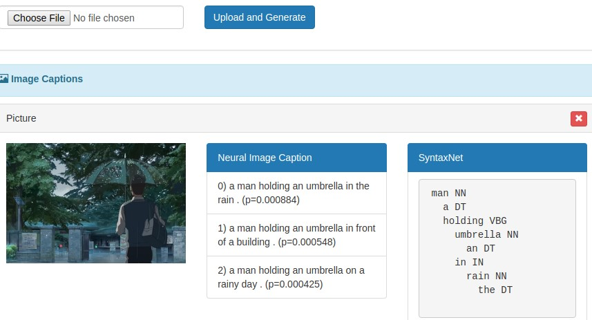
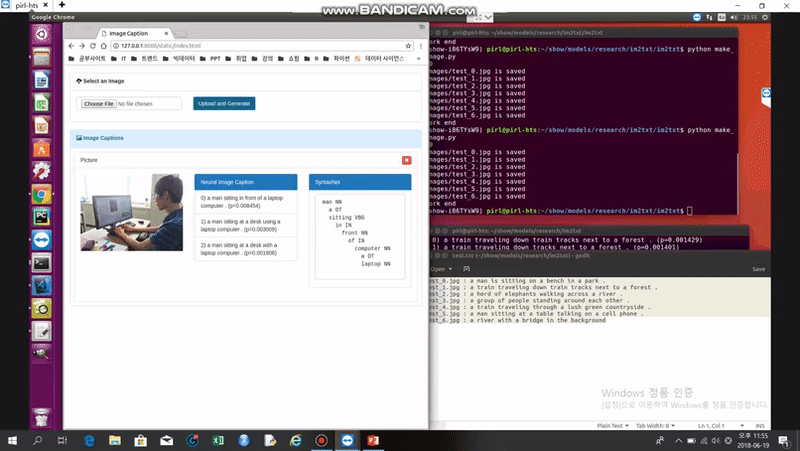
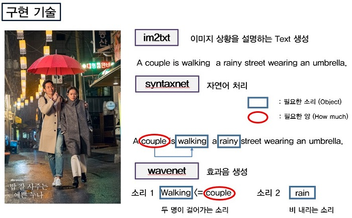

# 포스텍 정보통신연구소 3기 교육생 프로젝트

[SourceCode 확인 - docker ](https://hub.docker.com/r/yahwang/foley/)

## AI Foley

목표 : 상황에 맞는 효과음을 생성하는 AI 프로젝트

### 최종 구현 : [im2txt](https://github.com/tensorflow/models/tree/master/research/im2txt)를 활용한 Image Captioning과 [syntaxnet](https://github.com/tensorflow/models/tree/master/research/syntaxnet)을 통한 구문분석

참고 : [im2txt_demo](https://github.com/hologerry/im2txt_demo)의 웹페이지를 수정하여 만듬 

#### 구현한 웹페이지 모습 ( Django )

### 구현하려된 계획

### 프로젝트 검토 및 한계점

- 프로젝트 구조

&nbsp;이번 프로젝트의 범위가 구체적이고 명확하지 않은 점이 문제가 되었다. 상황이라는 것이 매우 광범위한 문제여서 어떤 특정한 상황에 대한 정의가 필요했다. MIT에서 진행한 프로젝트도 하나의 스틱 소리를 다양한 환경에서 내는 프로젝트를 진행했다. 게다가, 기존에 존재하는 오픈소스 하나로 해결할 수 없었다. 결국 프로젝트 자체를 새로 정의하려고 하다보니 진행이 더디고 여러 오픈소스를 조합하기도 쉽지 않았다. 

- im2txt 이미지 captioning 한계

&nbsp;&nbsp;word_counts.txt라는 파일을 읽어보면 학습된 모델 이미지 자체가 제한적이라는 것을 확인할 수 있다. 기본적으로 학습을 위해서는 이미지와 그에 맞는 caption을 포함한 데이터를 가지고 있어야 한다. MSCOCO에서 제공하는 데이터를 활용할 수는 있지만 분류 자체가 일반적이다. 특정 상황을 이해하려면 그 상황에 자주 나오는 
다량의 이미지와 caption을 학습해야 한다. 한 단어에 대한 많은 이미지 데이터가 있어야 비슷한 상황에서 그 단어를 추출할 수 있다. 일반적인 이미지를 해석하려면 해석이 제대로 되지 않는 것이 당연하다. 

- 효과음 정의의 한계

&nbsp;&nbsp;syntaxnet을 통해 구문을 분석하면 필요한 효과음에 대한 정의를 알 수 있을 거라 생각했다. 
“a man is walking in the rain” 을 보면, a man 한 사람이 walking 걷고 있다. in the rain 비 오는 상황에서
비 오는 상황에서 걷는 소리는 rain이 walking을 수식한다는 의미를 알아야 알 수 있다. syntaxnet을 통해 각각의 상황을 알 수 있을 지 모르지만 이를 일반화해서 정의한다는 문제는 쉽게 해결할 수 없었다. 효과음을 정의할 수 있어야 그에 맞는 효과음을 일치시킬 수 있다. 이 단계에서 명확하게 방향을 잡기가 어려웠다.  

- 효과음 생성의 한계

&nbsp;&nbsp;wavenet을 통해 효과음의 특징을 추출하면 관련된 소리를 만들 수 있을 거라 생각했다. 예를 들면, 한 사람의 발소리를 학습하면 2명 이상의 발소리를 만들어 내는 것이다. 하지만 학습에 필요한 소리 자체가 노이즈가 많이 포함되어 있을 수 있고 명확한 특징이 존재하지 않을 수 있다는 점을 알게 되었다. 발소리도 비오는 상황, 복도, 아스팔트 등 다양한 환경에서 녹음이 된 소리가 제각각 필요할 것이다. 하나의 상황에는 다양한 효과음의 조합이 필요하다. 주파수는 서로의 간섭이 생기기 때문에 단순 더하는 문제가 아니다. 이를 AI 작곡처럼 다양한 효과음을 자연스럽게 하나의 소리로 연결이 될 것이라고 생각했다. 이를 위해서는 VAE와 같은 기술에 대한 검토가 필요하다는 것을 알게 되었다.

